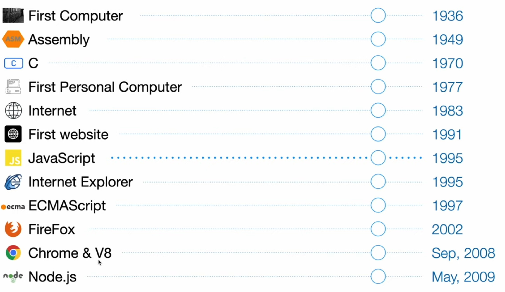

# adasdasd :

-   
-   `Nodejs is a c++ app that has v8 embedded to it.`

-   Node.js is indeed designed for server-side development, and it is often used to create network applications, including web servers and various types of network services. It is known for its `non-blocking, event-driven architecture, which makes it well-suited for handling a large number of concurrent connections and I/O-intensive operations`. Developers commonly use Node.js to build scalable and high-performance server applications.

    However, it's important to clarify a few points:

    1. `Node.js is not a system language`: Node.js is not a low-level system programming language like C or C++. It's a runtime environment for JavaScript, primarily used for server-side scripting. System languages are typically used to develop the operating system itself and low-level system software.

    2. `Node.js is not the same as JavaScript`: While Node.js uses JavaScript as its primary programming language, it extends JavaScript to work on the server side. JavaScript, as a language, was originally designed for client-side scripting in web browsers. Node.js provides a runtime environment that allows JavaScript to be executed on the server.

    3. `Node.js is not limited to network applications`: While Node.js is often associated with network applications and web servers, it can be used for a wide range of applications, including command-line utilities, file processing, automation scripts, and more. Its versatility extends beyond just network-related tasks.

# Event Loop :

-   The event loop is not a data structure like a stack or priority queue, nor is it a standalone program. Instead, it is a `programming construct` and a core part of JavaScript's runtime environment, including environments like Node.js. The event loop is responsible for managing the execution of asynchronous code and event-driven operations in a non-blocking manner.

Here's a simplified explanation of what the event loop is:

1. Conceptual Component: The event loop is a conceptual component that orchestrates the execution of code in a non-blocking and asynchronous environment.

2. Control Flow: It controls the flow of execution by continuously checking the event queue for pending tasks and callbacks.

3. Task Scheduler: When asynchronous operations are initiated, their associated callback functions are scheduled to run at a later time. The event loop manages the scheduling and execution of these tasks.

4. Non-Blocking: One of the key characteristics of the event loop is that it allows the main execution thread to continue processing other code while waiting for asynchronous tasks to complete. It does not block the execution.

5. Queue: While it's not a data structure like a stack or queue itself, it relies on a data structure known as an event queue (usually implemented as a queue) to store and manage the tasks and callbacks that need to be executed.

## `Programming Construct` :

-   A "programming construct" is a fundamental building block or element of a programming language or system that serves a specific purpose within a program.
    .
    .
    .
    .
    .
    .
    .
    .
    .
    .
    .
    .
    .
    .
    .
    .
    .
    .
    .

# How do Processors Understand Code?

# Assembly Language Application Demo

# C++ Application Demo

# JavaScript and JavaScript Engines

# V8 JavaScript Engine

# Taking a Look at V8’s Source Code

# Understanding How V8 is used by Node.js

# Taking a Look at Node’s Dependencies

# Project Ideas using V8

# Taking a Look at Node’s Source Code

# Taking a Look at other Node.js Files

# A Brief History of JavaScript & Node.js

# Understanding LibUV (Processes & Threads)

# Understanding Node.js Process

# Event Loop in Node.js

# Thread Pool or Worker Pool

# Don’t Block the Main Thread
