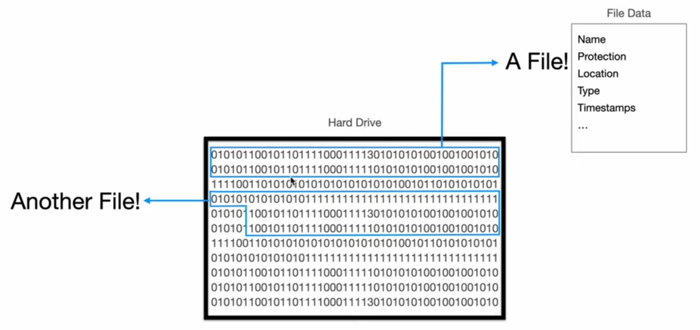

# what is a file :

-   Every thing on our computer system is a file. Everything on our hard-drive is in form of files. The OS itself is just different files.
-   

# How nodejs deals with files :

-   NodeJs itself has no idea how to access the hard-drive and then open a file and access the bits there.
-   `NodeJs has the system-calls`, which it is uses to talk to the operating system which inturn goes to the hard-drive and does the necessary thing.
-   We execute some function in nodejs and then nodejs using `libuv` calls the respective system-call to the OS.

# Promise, Callback and synchronous Apis :

-   In nodejs we have 3 different ways to deal with file systems.
    1. `Promises API` : Used in most of the situations.
    2. `Callback API` : it is used in rarest of cases when high perfomance is very critical, as this is faster then the promises way.
    3. `Synchronous API` :
        - never used unless we are sure that getting a particular task done is necessary to go to the next step, like - reading the configuration files before we actually start the application, bcz until then we will get error.
        - In this way of doing things we are actually `blocking the main thread`.
-   They differ not in terms of functionality but their internal implementation or the way how differently they carry out the same things.

# Most frequently used `fs module` functions :-

-   The fs module in Node.js is used for file system operations. Some of the most commonly used functions in the fs module include:

1. `fs.readFile()` : Used to read the contents of a file asynchronously.

2. `fs.readFileSync()` : Synchronously reads the contents of a file.

3. `fs.writeFile()` : Writes data to a file asynchronously, creating the file if it doesn't exist or overwriting it if it does.

4. `fs.writeFileSync()` : Synchronously writes data to a file.

5. `fs.readdir()` : Reads the contents of a directory asynchronously, returning an array of filenames.

6. `fs.readdirSync()` : Synchronously reads the contents of a directory.

7. `fs.stat()` : Retrieves information about a file or directory asynchronously, like size, type, and permissions.

8. `fs.existsSync()` : Synchronously checks if a file or directory exists.

9. `fs.unlink()` : Deletes a file asynchronously.

10. `fs.rmdir()` : Removes a directory asynchronously.
