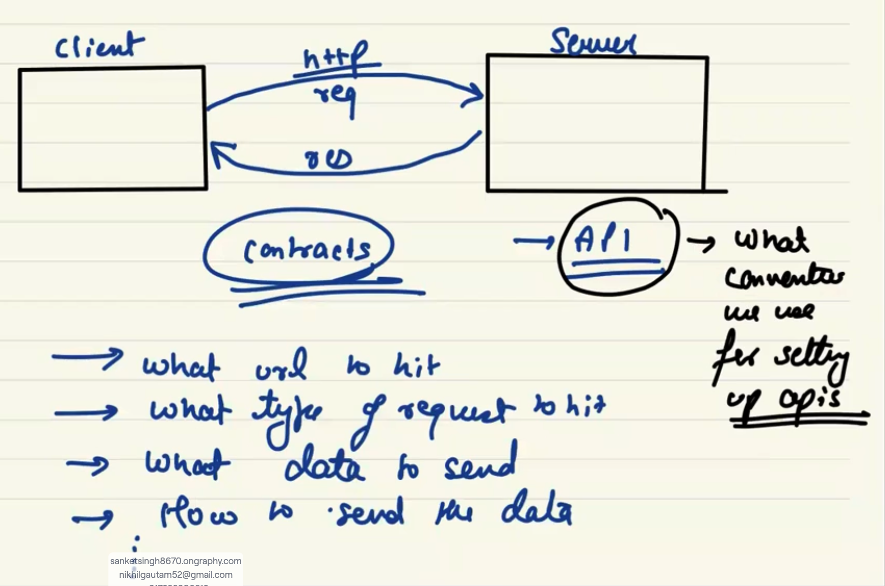

# client Server Architecture :

-   

# Different conventions we use to setup an API / different API architecture :

1. REST (Representational State Transfer)
2. SOAP (Simple Object Access Protocol)
3. gRPC (gRPC Remote Procedure Call)
4. GraphQL
5. WebSocket
